# 🐟 Fish-Lateral-Inspired Pressure Sensing and Neural Networks for Underwater Object Identification

This repository contains the full implementation of our IEEE OCEANS 2021 paper:  
**"Fish-lateral-inspired pressure sensing neural networks for underwater object identification"**

We simulate 2D pressure fields around a bio-inspired hydrofoil using LilyPad (a BDIM-based fluid-structure interaction solver). The pressure data is processed with dimensionality reduction (POD + PCA), and a neural network is trained to predict properties of nearby underwater objects (shape, orientation, distance, etc.).

---

## 🔍 Overview

- 💧 **Simulation**: Using LilyPad to model how pressure evolves on a hydrofoil passing by submerged objects of different shapes and positions.
- 📉 **Data Processing**: Dimensionality reduction via POD (Proper Orthogonal Decomposition) and PCA.
- 🧠 **Neural Network**: Fully connected regression model trained to predict object parameters from pressure readings.
- 🧪 **Dataset**: 5500 CFD simulations with randomized object configurations.

---

## 🖼️ Visuals from the Paper

### Fig 1: Simulation Setup

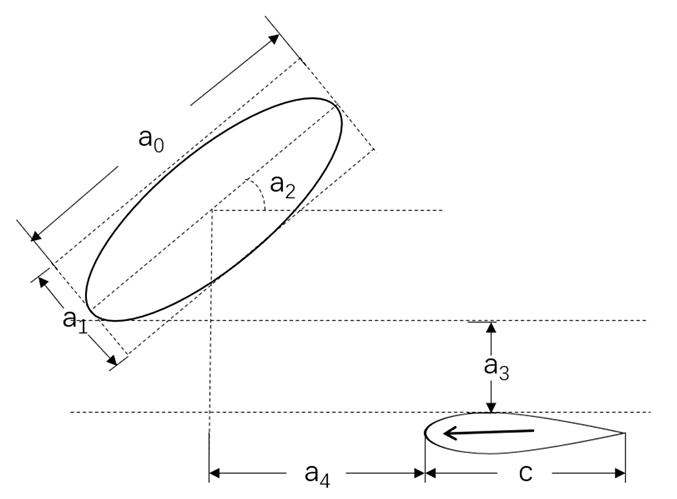

> A foil (sensor array) moves past an underwater object. Object parameters like size, angle, and position are randomized across simulations.

---

### Fig 2: Pressure Distribution Over Time

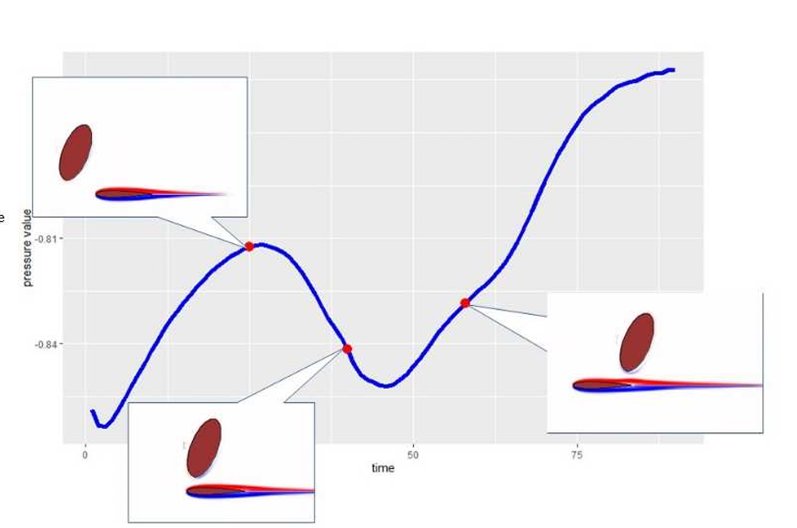

> (a) Pressure along the foil during object interaction. (b) Time-series of pressure at a single point on the foil.

---

### Fig 4: Data Flow Pipeline

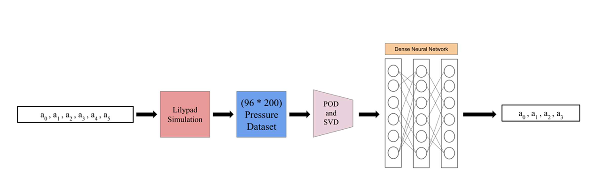

> Data is collected from LilyPad simulation, processed through POD and PCA, and used to train a neural network to infer object geometry.

---

### Fig 5: POD Energy Efficiency

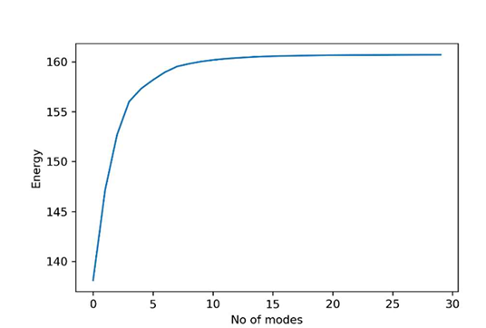

> POD captures 98% energy in just ~22 modes on average — allowing fast and meaningful dimensionality reduction.

---

### Fig 6: Model Training Loss

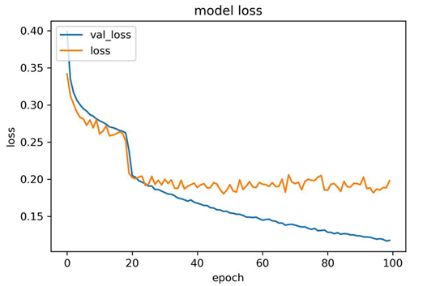

> Loss curve during training. The model begins to plateau after ~20 epochs, suggesting room for deeper architectures or more data.

---

### Fig 7–10: Parameter Predictions

| Parameter | Plot |
|----------|------|
| Object Length (`a_0`) | 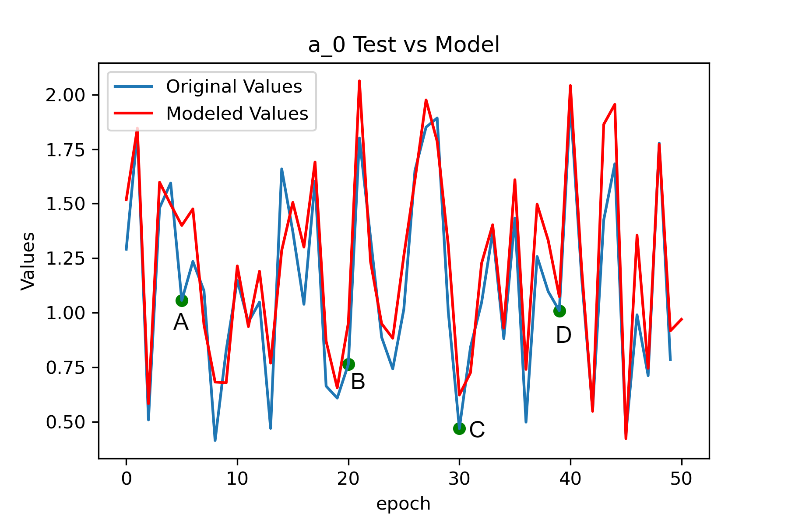 |
| Object Height (`a_1`) | 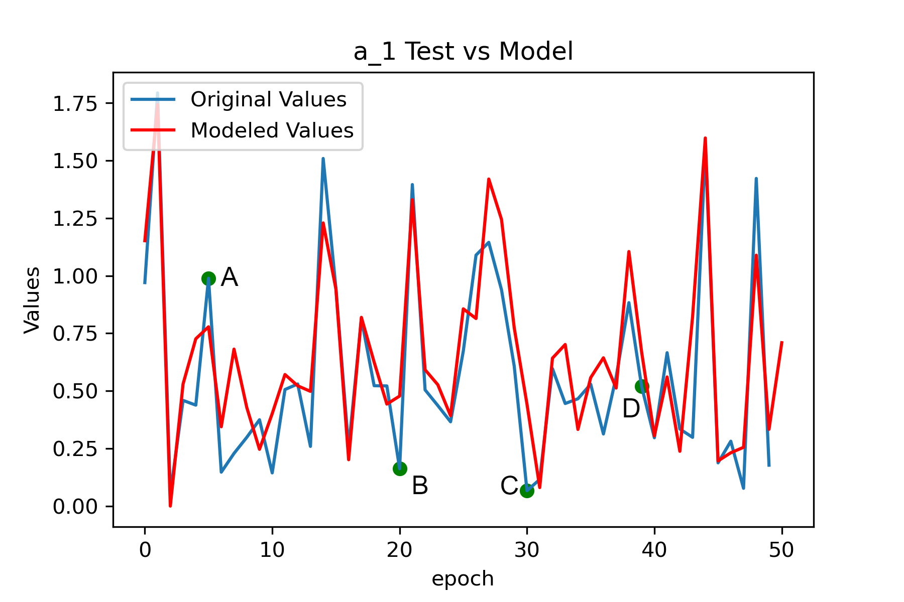 |
| Object Angle (`a_2`) | 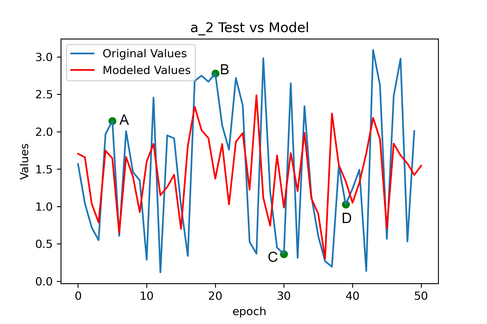 |
| Object Vertical Distance (`a_3`) | 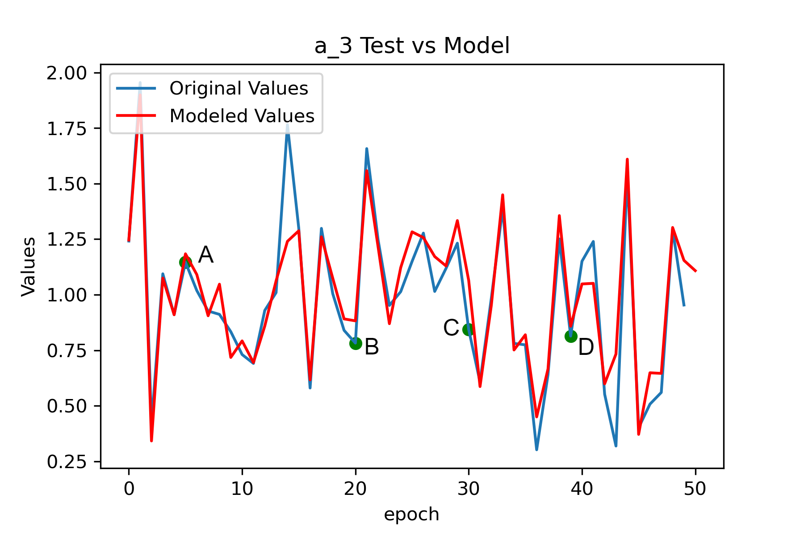 |

---

### Fig 11–14: Shape Prediction Visuals

Predicted vs original object geometry (red = actual, transparent = predicted).

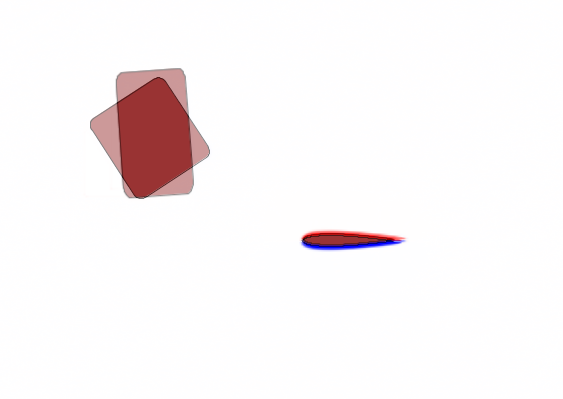
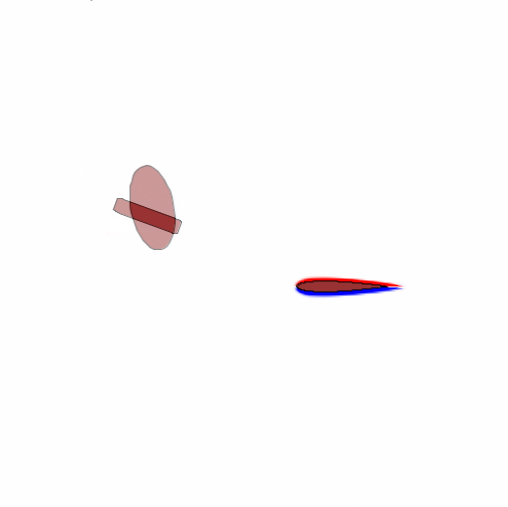
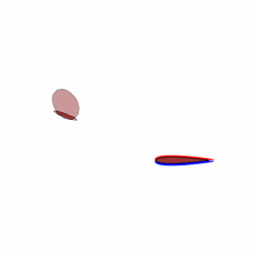
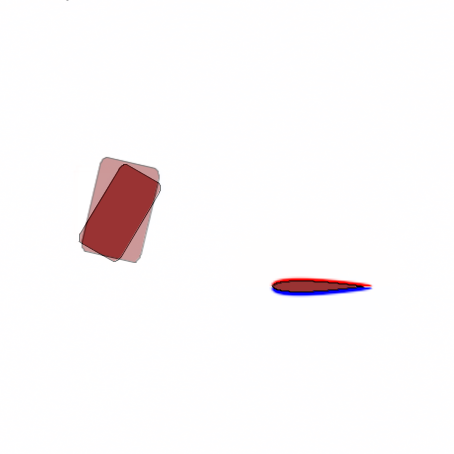

---

## 📁 File Structure

```bash
├── Code.ipynb                # Main notebook for training pipeline
├── /data                     # Pressure time-series CSVs from LilyPad
├── /images                   # Extracted visuals from paper
│   ├── fig1_simulation_setup.png
│   ├── fig2_pressure_distribution.png
│   ├── fig4_pipeline.png
│   ├── fig5_energy_vs_mode.png
│   ├── fig6_loss_plot.png
│   ├── fig7_a0.png
│   ├── fig8_a1.png
│   ├── fig9_a2.png
│   ├── fig10_a3.png
│   ├── fig11_pointA.png
│   ├── fig12_pointB.png
│   ├── fig13_pointC.png
│   └── fig14_pointD.png
└── README.md
